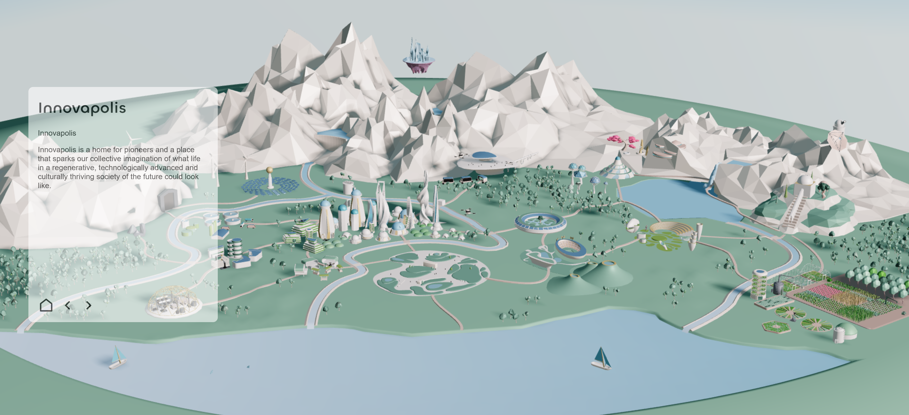

# Villages

Naviage, explore and discover this virtual village.

The project uses [Svelte](https://svelte.dev/), [Three.js](https://threejs.org/) and [Typescript](https://www.typescriptlang.org/). It features a small animation system, a simple state management system and a simple event system.

## Get started

1. ``npm install``
2. ``npm run dev``

